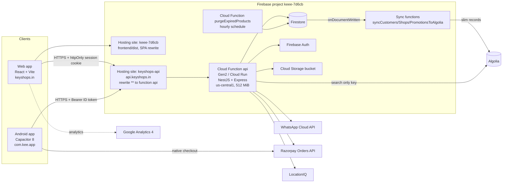
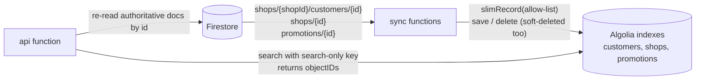

# Key Shops — Technical Documentation

End-to-end reference for the Key Shops platform (keyshops.in · Android app `com.kee.app` · Firebase project `keee-7d6cb`): architecture, repository layout, security model, data model, every API endpoint, every third-party integration, the end-to-end business flows, and how to build, test, deploy and operate it.

> **Scope and accuracy.** This document describes the code in this repository as of app version **1.58.18** (Android `versionCode` 115). The endpoint catalogue (section 8) was generated from the controllers' decorators, so it matches the code exactly (99 routes). No secret values appear anywhere in this document or in the repository — only variable *names*.

---

## Table of contents

1. [What the product is](#1-what-the-product-is)
2. [Architecture](#2-architecture)
3. [Repository layout](#3-repository-layout)
4. [Authentication, roles and sessions](#4-authentication-roles-and-sessions)
5. [Security controls](#5-security-controls)
6. [Data model (Firestore)](#6-data-model-firestore)
7. [Cross-cutting backend behaviour](#7-cross-cutting-backend-behaviour)
8. [API reference](#8-api-reference)
9. [Third-party integrations](#9-third-party-integrations)
10. [End-to-end flows](#10-end-to-end-flows)
11. [Frontend and Android app](#11-frontend-and-android-app)
12. [Configuration and environment variables](#12-configuration-and-environment-variables)
13. [Build, test and deploy](#13-build-test-and-deploy)
14. [Operations runbook](#14-operations-runbook)
15. [Known limitations and open items](#15-known-limitations-and-open-items)
16. [Appendix: history of the stack](#16-appendix-history-of-the-stack)

---

## 1. What the product is

Key Shops is a multi-tenant SaaS for key-making / locksmith shops in India.

| Actor | What they do | Where they use it |
|---|---|---|
| **Shop Admin** (shop owner) | Registers customers and the keys made for them, issues service invoices, records vehicle sales (Delivery Receipt), publishes promotions/ads, manages the shop profile and documents, tracks referrals. | **Android app only** (web login is deliberately blocked for this role). |
| **Super Admin** (platform operator) | Provisions and suspends shops, manages subscriptions, the master key catalogue, reference lists (categories, product types, key types), advertisements, support settings, revenue, reads contact messages and the activity log. | Web dashboard at keyshops.in (and the app). |
| **Public visitor / customer** | Browses the public directory of shops, machines/offers and ads, searches, contacts the platform, downloads an invoice from a link sent on WhatsApp. | keyshops.in, or the app before login. |

Core capabilities: shop self-registration with a paid yearly subscription (or a free trial), customer + key registration with an encrypted ID proof, PDF service invoices shared over WhatsApp, vehicle-sale Delivery Receipts in six languages, a master key catalogue, a promotions/ads marketplace, referral rewards, platform dashboards, activity logging, and full-text search.

## 2. Architecture

Everything runs on Google Firebase / Google Cloud, plus a few external APIs.



**Key design decisions**

- **One backend, one data access point.** The NestJS app (running as the `api` Cloud Function) is the only thing that reads or writes Firestore, Auth and Storage, through the Firebase **Admin SDK**. `firestore.rules` and `storage.rules` are deny-all, so no client can reach the data directly; authorisation is enforced in application code (guards + custom claims).
- **Tenancy is structural.** Everything a shop owns lives under `shops/{shopId}/…` (customers, documents, subscriptions, vehicle sales). There is no runtime "tenant filter" to forget — the path *is* the scope, and `shopId` always comes from the verified token claims, never from the request.
- **Stateless and serverless.** The function scales to zero; anything in memory (TTL caches, throttle counters, the 60-second auth cache) is per-instance and treated as an optimisation, never as a source of truth. Hourly maintenance runs on Cloud Scheduler (`purgeExpiredProducts`) because an in-process timer cannot be relied on.
- **Search is outsourced.** Firestore cannot do substring/fuzzy search, so a Cloud Function mirrors a slim, allow-listed copy of customers/shops/promotions into Algolia; the API asks Algolia *which* documents matched and then re-reads the authoritative Firestore documents.
- **Same-site cookies for web, bearer tokens for native.** `keyshops.in` and `api.keyshops.in` share the registrable domain, so an httpOnly `Domain=.keyshops.in` cookie works for the web app; a Capacitor WebView does not carry cross-origin cookies reliably, so the Android app sends the Firebase ID token in the `Authorization` header.

### Deployed components

| Component | Name / URL | Notes |
|---|---|---|
| Website | `keyshops.in`, `www.keyshops.in`, `keee-7d6cb.web.app` | Hosting target `default` → `frontend/dist`, SPA rewrite to `/index.html`. Also serves the APK at `/downloads/keyshop-app.keeapp`. |
| API | `https://api.keyshops.in` | Hosting target `api` (site `keyshops-api`), rewrite `**` → function `api` (us-central1). |
| API function | `api` (Gen2, Node 22, 512 MiB, 60 s timeout, public invoker) | Codebase `api`, source `backend/functions-api` (generated). |
| Scheduled job | `purgeExpiredProducts` (every 60 min) | Same codebase; deletes expired PRODUCT promotions. |
| Search sync | `syncCustomersToAlgolia`, `syncShopsToAlgolia`, `syncPromotionsToAlgolia` | Codebase `sync`, source `backend/functions`; Firestore `onDocumentWritten` triggers. |
| Database | Firestore (default database) | Indexes in `backend/firestore.indexes.json` (25 composite). |
| Auth | Firebase Authentication | Email/password provider; custom claims. |
| Files | Cloud Storage default bucket | Private; accessed only through signed URLs. |

## 3. Repository layout

```
.
├── README.md                       Quick start
├── firebase.json                   Hosting config (targets: default, api)
├── .firebaserc                     Project keee-7d6cb and hosting target mapping
├── docs/
│   ├── TECHNICAL_DOCUMENTATION.md  This document
│   ├── Kee_User_Manual.pdf         End-user manual (still describes the retired SMS OTP - needs a refresh)
│   └── Kee_Non_Technical_Documentation.pdf
├── scripts/
│   └── deploy-web.js               Build + embed APK + deploy Hosting + verify live APK hash
├── backend/                        NestJS 10 API (TypeScript)
│   ├── firebase.json               Functions codebases, Firestore/Storage rules, emulators
│   ├── firestore.rules / storage.rules   Deny-all
│   ├── firestore.indexes.json      Composite indexes
│   ├── src/
│   │   ├── functions-main.ts       Cloud Functions entry (exports `api`, `purgeExpiredProducts`)
│   │   ├── main-firestore.ts       Standalone server entry (`npm run start:prod`)
│   │   ├── auth/                   Role enum, @Roles(), RolesGuard, per-user auth cache
│   │   ├── common/                 Exception filter, session cookie, ttl-cache, pick(), validators,
│   │   │                           subscription-status, required-env, base64 utils
│   │   ├── crypto/                 CryptoService (AES-256-GCM for ID proof / Aadhaar numbers)
│   │   └── firestore/              The application module and every feature
│   │       ├── firestore-app.module.ts   Module, controllers, providers, throttler setup
│   │       ├── firestore.service.ts      Firebase Admin app + Firestore handle
│   │       ├── auth/               FirebaseAuthService, FirebaseAuthGuard, auth controller
│   │       ├── shop/               Shop services, registration transaction, public shop directory
│   │       ├── customer/           Customer registration/CRUD, documents, invoices (reports)
│   │       ├── vehicle-sale/       Vehicle Sales (Delivery Receipt) API
│   │       ├── key/                Master key catalogue
│   │       ├── promotion/, ad/     Promotions and advertisements
│   │       ├── config/             Reference lists, platform/support config
│   │       ├── report/             Dashboards, revenue, activity log
│   │       ├── notification/, contact/, payment/, geo/, search/, storage/
│   │       ├── whatsapp-otp.service.ts, whatsapp-invoice.service.ts
│   │       └── health.controller.ts
│   ├── functions/                  "sync" codebase: Algolia sync functions + algolia-fields.js allowlist
│   ├── functions-api/              Generated deploy folder for the `api` function (dist, package.json; .env is local, gitignored)
│   └── scripts/                    Bootstrap server, seeders, reindex, cleanup, smoke tests, packaging
└── frontend/                       React 18 + Vite 5 + Tailwind; Capacitor 8 Android project in android/
    ├── src/
    │   ├── App.jsx                 Shell, navigation, public site, dashboards
    │   ├── apiConfig.js            API base URL, asset URLs, native download helper
    │   ├── context/AuthContext.jsx Session handling + every API call
    │   ├── views/                  Screens (customers, shops, keys, vehicle sales, promotions, ...)
    │   ├── components/             Public site, OTP modal, shared widgets
    │   ├── utils/                  PDF generation, WhatsApp sharing, phone, platform, analytics
    │   └── i18n/                   English, Hindi, Tamil, Telugu, Kannada, Malayalam strings
    └── android/                    Capacitor Android project (custom plugins in app/src/main/java/com/kee/app)
```

## 4. Authentication, roles and sessions

### 4.1 Identity model

- **Firebase Auth owns passwords.** The backend never stores or hashes login passwords.
- **Login identifier is a phone number or an email.** Firebase password sign-in only accepts an email, so a user who registered with only a phone number gets a synthetic Auth email `<10-digit-phone>@phone.keyshops.internal` (never shown to the user). The Firestore `users/{uid}` document keeps the real email as `null` in that case.
- **Roles live in custom claims** on the Firebase user: `{ role: 'SUPER_ADMIN' | 'SHOP_ADMIN', shopId }`. A Super Admin has no `shopId`.
- **Super Admins are provisioned by an operator** (a Firebase Auth user + `users/{uid}` document + custom claims); there is no self-registration path. `backend/scripts/seed-ui-test-accounts.ts` shows the pattern.
- **Phone format.** Indian mobile numbers, 10 digits starting 1–9 (`/^[1-9]\d{9}$/`), normalised by `common/validators/phone.ts`.

### 4.2 Login

```mermaid
sequenceDiagram
  participant C as Client (web or app)
  participant API as api function
  participant FA as Firebase Auth
  participant FS as Firestore
  C->>API: POST /api/auth/login {email|phone, password, platform}
  API->>FS: resolve login email (emailIndex / phoneIndex / users)
  API->>FA: accounts:signInWithPassword (REST, Web API key)
  FA-->>API: ID token + uid
  API->>FS: load users/{uid}; check shop active + subscription
  alt platform = native
    API-->>C: { accessToken = ID token, user, subscription? }
  else web
    API->>FA: createSessionCookie(ID token, 24 h)
    API-->>C: Set-Cookie kee_session (httpOnly) + { accessToken, user, subscription? }
  end
```

Rules enforced at login:

- A **Shop Admin may only sign in with `platform: "native"`** (the Android app). A web attempt returns 401 with a "download the app" message.
- A suspended shop (`isActive = false`) → 401.
- Subscription state `GRACE_PERIOD_EXPIRED` → 401 with the "subscription expired" message. During `GRACE_PERIOD` the login succeeds and the response carries `subscription: { state, daysRemaining, endDate }` so the UI can warn.
- Wrong password and unknown user return the same generic "Invalid email or password".
- A `LOGIN` row is written to `activityLogs` (fire-and-forget).

### 4.3 Every authenticated request

`FirebaseAuthGuard` (`firestore/auth/firebase-auth.guard.ts`):

1. Extracts the credential: `Authorization: Bearer <token>` first (native), otherwise the `kee_session` cookie (web).
2. Verifies it with the Admin SDK — ID token first, then session cookie as a fallback.
3. Loads the user's role/shop from the token claims and `users/{uid}`, and (for Shop Admins) checks the shop is active and the subscription has not fully lapsed.
4. Caches the per-user result for **60 seconds** per instance (`auth/auth-cache.ts`) so these Firestore reads don't run on every request. Anything that changes a shop's status, a subscription, or a user's login identifiers calls `invalidateAuthCache(uid)` so a suspension takes effect immediately on the instance that handled it, and within 60 s elsewhere.
5. Puts `req.user = { id, email, phone, name, role, shopId }` on the request.

`RolesGuard` then checks `@Roles(...)` against `req.user.role`. The two guards are always applied together — `FirebaseAuthGuard` alone proves only "authenticated".

### 4.4 Subscription lifecycle

| State | Condition | Effect |
|---|---|---|
| `ACTIVE` | now ≤ `endDate` | Normal. |
| `GRACE_PERIOD` | up to **3 days** after `endDate` | Login and API work; `/auth/me` and login return `subscription.daysRemaining`. |
| `GRACE_PERIOD_EXPIRED` | beyond grace | Login and API calls rejected until the Super Admin renews (`POST /api/super/subscriptions/:shopId`). |

Plans: `TRIAL` (default 14 days, `config/platform.trialDays`) and `YEARLY` (price `config/platform.subscriptionPrice`, default ₹999 + GST 18 %). The "latest" subscription document of a shop decides the state.

### 4.5 OTP

OTP gates sensitive, unauthenticated or high-risk actions. It does **not** create a login session.

| `purpose` | Used for | Code may be shown in UI as fallback* |
|---|---|---|
| `register` | Shop self-registration | yes |
| `customer_verify` | Verifying a customer's phone during registration | yes |
| `change-credentials` | Changing the login phone | yes |
| `reset` | Public password reset | **never** |
| `delete-account` | Account deletion | **never** |

\* Temporary pre-WhatsApp fallback: only when `OTP_SHOW_CODE_IN_UI=true`, the WhatsApp send failed or is not configured, and the purpose is on the allow-list. `reset` and `delete-account` are excluded because shop phone numbers are public, so showing those codes would allow account takeover.

Mechanics (`firestore/whatsapp-otp.service.ts`, collection `otpCodes`):

- 4-digit code, **bcrypt-hashed** (cost 10), 5-minute TTL, max 5 wrong attempts per code; a new send supersedes any pending code for the same `(identifier, purpose)`.
- `verify-otp` marks the record `consumed` and stamps `verifiedAt`. The follow-up action (reset password / change phone / delete account) must then **redeem** that verification within **15 minutes**; redemption is single-use (`verifiedAt` is cleared).
- Delivery: WhatsApp Cloud API template message (see §9.4). Fail-soft: a delivery failure never throws — it returns `{ success: true, delivered: false }`.
- Rate limits: `send-otp` 6 / 10 min / IP, `verify-otp` 10 / 10 min / IP.

### 4.6 Password and credential operations

| Action | Endpoint | Requirement |
|---|---|---|
| Forgot password | `POST /api/auth/reset-password-public` | A freshly verified `reset` OTP for that phone (the OTP *is* the authentication). New password ≥ 6 chars. |
| Change password | `POST /api/auth/change-password` | Logged in + current password verified against Firebase. |
| Change login phone | `POST /api/auth/update-credentials` | Logged in + verified `change-credentials` OTP on the **new** number; updates Auth phone number, `users`, `phoneIndex` atomically. |
| Delete account | `DELETE /api/auth/account` | Logged in + verified `delete-account` OTP. Soft-deletes user and shop, disables the Auth user, invalidates cache, so the next request returns 401. |
| Logout | `POST /api/auth/logout` | Clears the `kee_session` cookie. |

## 5. Security controls

| Area | Control |
|---|---|
| Direct data access | `firestore.rules` and `storage.rules` are deny-all; only the Admin SDK (server) can read/write. |
| Authorisation | `FirebaseAuthGuard` + `RolesGuard` on every private route; `shopId` always taken from the token, never from the body/query (Super Admin may pass `?shopId=` on shared shop-settings routes). |
| Mass assignment | Update endpoints copy fields through an allow-list (`common/pick.util.ts`); the vehicle-sale API reads each field explicitly. |
| Sensitive data at rest | Customer ID-proof numbers and shop Aadhaar numbers are AES-256-GCM encrypted (`CryptoService`, key `ENCRYPTION_KEY`). In production the server **refuses to start** without the key (`common/required-env.ts`). |
| Data sent to third parties | Algolia receives only an allow-listed slim record (`functions/algolia-fields.js`) — never ID numbers, coordinates, photo links or Aadhaar ciphertext. |
| Session cookie | `kee_session`: httpOnly, `Secure` in production, `SameSite=Lax`, `Domain=.keyshops.in`, 24 h. |
| CORS | Explicit origin allow-list with credentials: `keyshops.in`, `www.keyshops.in`, `keee-7d6cb.web.app`, `https://localhost`, `capacitor://localhost` (plus `http://localhost:*` outside production). Others get no CORS headers. |
| Rate limiting | `@nestjs/throttler`: global 120 req/min/client, tighter per-route limits on auth, OTP, registration, payment, contact and public lookups. The client key is the first `X-Forwarded-For` address (behind Google's frontends `req.ip` is shared). Counters are in memory, per instance. |
| Error handling | `AllExceptionsFilter`: `HttpException`s pass through; anything else is logged server-side and returned as a generic `500 {"statusCode":500,"message":"Internal server error"}` — internal error text never reaches clients. |
| Payment | Razorpay signature (HMAC-SHA256 of `orderId|paymentId`) verified with a constant-time compare before any account is created. Key secret never leaves the server. |
| Public files | Customer invoices are served from `GET /api/public/reports/:id/download` using an unguessable document id as a capability link (throttled 20/min). Other files use time-limited signed URLs. |
| Throttled public lookups | `/api/public/*` routes are limited to 60 req/min. |
| Web login for shop owners | Blocked by design; Shop Admin credentials work only from the Android app. |
| Local safety | The standalone server and smoke-test bootstrap delete `RAZORPAY_KEY_ID/SECRET` from the environment so a local run can never create a live payment order. |

## 6. Data model (Firestore)

All timestamps are **numeric epoch milliseconds**. "Soft delete" means a `deletedAt` number (null when live); readers must filter on it. Document ids are Firestore auto-ids unless stated.

### 6.1 Collection map

```
users/{uid}                              Firebase Auth uid; profile + role + shopId
emailIndex/{lowercased email}            { uid }   uniqueness + login lookup
phoneIndex/{10-digit phone}              { uid }   uniqueness + login lookup
otpCodes/{id}                            OTP records (hashed)
razorpayPayments/{paymentId}             { shopId, orderId, createdAt }  makes a payment single-use for registration

shops/{shopId}                           Shop profile
  ├─ subscriptions/{id}                  Plans/terms of the shop
  ├─ customers/{customerId}              Customers registered by the shop
  │     └─ documents/{id}                Customer files (photo, ID proof, ...)
  ├─ documents/{id}                      Shop documents (photo, license, owner Aadhaar)
  └─ vehicleSales/{id}                   Vehicle-sale (Delivery Receipt) records

customerShopIndex/{customerId}           { shopId }  reverse lookup for cross-shop admin access
customerReports/{reportId}               Uploaded invoice PDFs (fileKey, fileName, customerId, shopId)
masterKeys/{shopId_keyNumber}            Key catalogue ("GLOBAL_<keyNumber>" when shopId is null)
promotions/{id}                          PRODUCT / AD / OFFER posts
advertisements/{id}                      BANNER / POPUP / NOTICE / APP_POSTER ads
notifications/{id}                       Shop / platform notifications
activityLogs/{id}                        Audit trail (shopId may be null for global Super Admin actions)
revenueRecords/{id}                      Monthly revenue entries
referrals/{referredShopId}               Referral relationships
contactMessages/{id}                     Public "contact us" messages
shopCategories/{id}, productTypes/{id}, keyTypes/{id}   Reference lists (soft-delete, names unique by lowercase id)
config/platform                          Singleton platform/support settings
```

### 6.2 Main document shapes

| Document | Fields |
|---|---|
| `users/{uid}` | `email`, `phone`, `name`, `role` (`SUPER_ADMIN`\|`SHOP_ADMIN`), `shopId`, `deletedAt`, `createdAt`, `updatedAt` |
| `shops/{id}` | `name`, `companyDetails` (JSON string: address/gst/phone), `logoUrl`, `themeColor`, `isActive`, `storageUsed`, `aadhaarNumber` (encrypted), `latitude`, `longitude`, `town`, `district`, `categoryId`, `referralCode` (the owner's phone), `referredByCode`, `referralPoints`, `deletedAt`, `createdAt`, `updatedAt` |
| `shops/{id}/subscriptions/{id}` | `plan` (`TRIAL`\|`YEARLY`), `status` (`ACTIVE`…), `startDate`, `endDate`, `createdAt`, `updatedAt` |
| `shops/{id}/customers/{id}` | `name`, `phone`, `address`, `idProofType`, `idProofNumber` (encrypted), `reason`, `keyNumber`, `keyType`, `vehicleNumber`, `masterKeyId`, `latitude`, `longitude`, `mapsLink`, `capturedAddress`, `photoUrl`, `billAmount`, `billNumber`, `vehicleName`, `lostKey`, `addKey`, `homeOfficeName`, `vehicleCategory`, `deletedAt`, `createdAt`, `updatedAt` |
| `shops/{id}/vehicleSales/{id}` | `saleNumber` (`VS-0001`…, assigned transactionally), `saleDate`, `saleTime`, seller/buyer name+address+phone, `registrationNumber`, `vehicleModel`, `vehicleColor`, `vehicleName`, `chassisNumber`, `engineNumber`, `vehiclePrice`, `advanceAmount`, `officeCommission`, `balanceAmount` (server-computed), `balanceLastDate`, witness name+address, `notes`, `lang`, `createdById`, `createdAt` |
| `masterKeys/{id}` | `keyNumber`, `category`, `backImageUrl`, `shopId` (null = global), `deletedAt`, timestamps. Id = `${shopId ?? 'GLOBAL'}_${keyNumber}` (deterministic uniqueness). |
| `promotions/{id}` | `type`, `title`, `description`, `imageUrls[]`, `price`, `discountPercentage`, `validUntil`, `linkedPromotionId`, `productType`, `phone`, `shopId`, `createdById`, `deletedAt`, timestamps |
| `advertisements/{id}` | `title`, `imageUrl`, `type`, `startDate`, `endDate`, `priority`, `targetAll`, `targetShops[]` |
| `notifications/{id}` | `shopId` (null = broadcast), `title`, `message`, `type`, `audience`, `isRead`, `createdAt` |
| `activityLogs/{id}` | `shopId`, `userId`, `action` (e.g. `LOGIN`, `SHOP_REGISTERED`, `DOC_UPLOAD`, `CHANGE_PASSWORD`, `DELETE_ACCOUNT`…), `details` (JSON string), `ipAddress`, `createdAt` |
| `config/platform` | `whatsapp`, `videos[{name,url}]`, `subscriptionPrice`, `gstPercent`, `email`, `customerCareNumber`, `trialDays` (defaults: price 999, GST 18, trial 14 days) |
| `otpCodes/{id}` | `identifier`, `purpose`, `codeHash`, `attempts`, `consumed`, `verifiedAt`, `createdAt`, expiry |

### 6.3 Composite indexes

Firestore's emulator does **not** enforce composite indexes, so a query that works locally can fail in production with `FAILED_PRECONDITION`. All 25 required indexes are in `backend/firestore.indexes.json` (otpCodes, shopCategories, productTypes, keyTypes, masterKeys, notifications ×2, promotions ×5, activityLogs ×2, revenueRecords, referrals, subscriptions ×3, customers ×4 incl. collection-group, advertisements ×2). Deploy with `firebase deploy --only firestore:indexes` from `backend/`. After adding any new query, run `backend/scripts/smoke-test-read-routes.ts` against the deployed API — it sweeps 43 read routes and fails on any 5xx.

### 6.4 Storage

Files live in the project's default bucket under keys generated by `FirebaseFileService` (`uploadFile`), and are returned to clients as **signed URLs** with a caller-chosen expiry. Categories: customer documents/photos, shop documents/logo, promotion and advertisement images, invoice PDFs (`customerReports`). Deleting an already-missing object is a no-op.

## 7. Cross-cutting backend behaviour

- **Global prefix** `/api`. JSON body limit 15 MB (base64 photo uploads and PDFs). `ValidationPipe({ transform: true })` only coerces types — most DTOs are plain interfaces validated by explicit code (only the reference-list, support-config and contact DTOs use `class-validator`).
- **Soft delete** is the norm (`deletedAt`); shop documents are the one hard-delete collection.
- **Pagination** is cursor-based (`cursor` = last document id, response `{ items, nextCursor }`), never offset-based. Some list endpoints return a bare array when no `limit` is passed (legacy shape kept for older clients).
- **Caching** (per instance): public ads (2 min), public shop search (60 s), public promotions (60 s), reverse geocoding (24 h, LRU-capped), auth check (60 s).
- **Aggregations** (platform dashboard, "popular keys", 6-month registration trend) fetch a bounded batch and aggregate in memory — correct at current volume; counters would be needed at much larger scale.
- **Fail-soft integrations.** WhatsApp, Algolia and LocationIQ never throw into the request: they log and fall back (OTP `delivered:false`, exact-match search, empty geocode).
- **Health check**: `GET /api/health` → `{status:"ok",timestamp}`; touches nothing, used by the app at boot to warm a cold instance.

## 8. API reference

Base URL: **`https://api.keyshops.in/api`** (local: `http://localhost:4100/api` with the bootstrap server, or the port used by the standalone server).

Conventions:

- **Auth column**: `Public` = no credentials; `Any` = any logged-in user; `Shop` = `SHOP_ADMIN`; `Super` = `SUPER_ADMIN`; `Shop+Super` = either role.
- Credential: native `Authorization: Bearer <ID token>`; web `kee_session` cookie (sent automatically with `credentials: 'include'`).
- Errors are JSON `{ statusCode, message, error? }`: `400` validation, `401` not authenticated / suspended / expired, `403` wrong role, `404`, `429` throttled, `500` generic.
- "Limit" = per client IP per window (`N/Ws`).
- `multipart` = `multipart/form-data` file upload (field `file` unless noted).

### 8.1 System

| Method | Path | Auth | Description |
|---|---|---|---|
| GET | `/health` | Public | Liveness probe. |

### 8.2 Authentication — `/auth`

| Method | Path | Auth | Limit | Body / notes |
|---|---|---|---|---|
| POST | `/auth/login` | Public | 20/600s | `{ email, password, platform }` — `email` holds an email **or** phone; `platform` = `native` for the app. Returns `{ accessToken, user, subscription? }`; web also gets the cookie. |
| POST | `/auth/logout` | Public | — | Clears the session cookie. |
| GET | `/auth/me` | Any | — | `{ user, subscription? }` (`subscription` only during grace period). |
| POST | `/auth/send-otp` | Public | 6/600s | `{ identifier (phone), purpose }` → `{ success, delivered, devCode? }`. |
| POST | `/auth/verify-otp` | Public | 10/600s | `{ identifier, purpose, code }` → `{ success }`. |
| POST | `/auth/register-shop` | Public | 5/600s | Shop self-registration. `{ shopName, ownerName, email?, phone, password, location, town?, district?, latitude?, longitude?, categoryId, aadhaarNumber? (12 digits), referralCode?, startTrial?, razorpayOrderId?, razorpayPaymentId?, razorpaySignature? }`. Payment fields are mandatory unless `startTrial`. Returns `{ success, shopId, loginPhone, message }`. |
| POST | `/auth/reset-password-public` | Public | 6/600s | `{ identifier (phone), newPassword }` after a verified `reset` OTP. |
| POST | `/auth/change-password` | Any | — | `{ oldPassword, newPassword }`. |
| POST | `/auth/update-credentials` | Any | — | `{ newPhone }` after a verified `change-credentials` OTP on the new number. |
| DELETE | `/auth/account` | Any | — | After a verified `delete-account` OTP. |

### 8.3 Payments — `/payment`

| Method | Path | Auth | Limit | Description |
|---|---|---|---|---|
| POST | `/payment/create-order` | Public | 10/600s | Creates a Razorpay order for the yearly subscription. Price comes from `config/platform` (not the client). Returns `{ orderId, amount (paise), currency, keyId, baseAmount, gstPercent, gstAmount, totalAmount }`. |

### 8.4 Public (no login)

| Method | Path | Limit | Query | Description |
|---|---|---|---|---|
| GET | `/public/shops` | 60/60s | `query, category, town, cursor, limit` | Public shop directory (vetted projection only). |
| GET | `/public/shops/:id` | 60/60s | — | One shop's public profile. |
| GET | `/public/search` | 60/60s | `q` | Combined shops + machines search for the pre-login app. |
| GET | `/public/machines` | 60/60s | `category, town, cursor, limit, shopId, search` | Public product/offer listings. |
| GET | `/public/machines/:id` | 60/60s | — | One listing. |
| GET | `/public/ads` | — | — | Active banner/popup/notice ads. |
| GET | `/public/ads/poster` | — | — | Current app poster. |
| GET | `/public/reports/:id/download` | 20/60s | — | Streams an invoice PDF (`Content-Disposition: attachment`); used by the WhatsApp invoice link. |
| GET | `/support-config` | 30/60s | — | Public platform settings (WhatsApp, videos, price, GST, email, care number, trial days). |
| POST | `/contact` | 5/600s | — | `{ name, email, message (10–5000 chars) }` — stored in `contactMessages`. |
| GET | `/geo/reverse-geocode` | — | `lat, lng` | Reverse geocoding via LocationIQ (server-side key, 24 h cache). |
| GET | `/key-types` | — | — | Reference list. |
| GET | `/product-types` | — | — | Reference list. |
| GET | `/shop-categories` | — | — | Reference list (ordered). |

### 8.5 Shop Admin — customers, keys, invoices

| Method | Path | Auth | Description |
|---|---|---|---|
| POST | `/shop/customers` | Shop | Registers a customer + key in one transaction (customer doc, master-key upsert, `customerShopIndex`, activity log, notification). Body = customer fields (§6.2); optional `photoBase64` (data URI) and `manualKey: { category }`. `idProofNumber` is encrypted server-side. |
| GET | `/shop/customers` | Shop | `search, cursor, limit, keysOnly, town`. Free-text uses Algolia when configured, else exact phone/key number. |
| GET | `/shop/customers/global-search` | Shop | `search` — same shop-scoped search as the list endpoint (kept for older clients). |
| PUT | `/shop/customers/:id` | Shop | Update (allow-listed fields). |
| POST | `/shop/customers/:id/docs` | Shop | multipart + `documentType`; adds a customer document (max 5 MB; JPEG, PNG or PDF only). |
| DELETE | `/shop/customers/:id/docs/:docId` | Shop | Removes a customer document. |
| POST | `/shop/customers/:id/report` | Shop | multipart + `fileName`; stores the generated invoice PDF (`customerReports`). |
| POST | `/shop/customers/:id/send-invoice` | Shop | `{ reportId }` — sends that customer's own invoice over WhatsApp (template message with a download link). Fail-soft. |
| GET | `/shop/keys/search` | Shop | `query` — search the master key catalogue visible to the shop. |

### 8.6 Shop Admin — vehicle sales

| Method | Path | Auth | Description |
|---|---|---|---|
| POST | `/shop/vehicle-sales` | Shop | Records a sale. Required: `buyerName`, `sellerName`, `registrationNumber`, `vehiclePrice` (> 0). Optional: `saleDate` (`YYYY-MM-DD`), `saleTime` (`HH:MM`), addresses, phones, `vehicleModel/Color/Name`, `chassisNumber`, `engineNumber`, `advanceAmount` (≤ price), `officeCommission`, `balanceLastDate`, witness, `notes`, `lang` (`en hi ta te kn ml`). The balance is **computed server-side**; the receipt number `VS-0001…` is allocated in a transaction. |
| GET | `/shop/vehicle-sales` | Shop | `limit`; newest first. |
| GET | `/shop/vehicle-sales/:id` | Shop | One sale (own shop only). |

### 8.7 Shop settings, notifications, dashboard, ads

| Method | Path | Auth | Description |
|---|---|---|---|
| GET | `/shop/settings` | Shop+Super | `?shopId=` (Super Admin only). Shop profile/settings. |
| PUT | `/shop/settings` | Shop+Super | Update profile (allow-listed). |
| POST | `/shop/settings/documents` | Shop+Super | multipart + `documentType` (`SHOP_PHOTO`\|`SHOP_LICENSE`\|`OWNER_AADHAAR`); replaces the existing document of that type. |
| DELETE | `/shop/settings/documents/:id` | Shop+Super | Hard-deletes a shop document. |
| POST | `/shop/settings/logo/upload` | Shop+Super | multipart; sets `logoUrl`. |
| POST | `/shop/settings/referral` | Shop+Super | Generates/returns the shop's referral code. |
| GET | `/shop/referral` | Shop+Super | Referral & rewards overview. |
| GET | `/shop/notifications` | Shop | Own + broadcast notifications (latest 50). |
| PUT | `/shop/notifications/:id` | Shop | Mark as read. |
| GET | `/shop/dashboard` | Shop | Shop dashboard aggregates. |
| GET | `/shop/advertisements` | Shop | Ads targeted at the shop. |
| GET | `/activity-log` | Shop+Super | `cursor, limit, shopId, action` (Shop Admin is forced to own shop; `LOGIN` excluded unless asked). |

### 8.8 Promotions

| Method | Path | Auth | Description |
|---|---|---|---|
| GET | `/promotions` | Any | Cross-shop feed. `includeExpiredOffers, cursor, limit, category, type (PRODUCT\|AD\|OFFER), excludeOffers, mine`. |
| POST | `/shop/promotions/upload-image` | Shop | multipart image → URL. |
| POST | `/shop/promotions` | Shop | `{ type, title, description?, imageUrls? (≤4), price?, discountPercentage?, validUntil?, linkedPromotionId?, productType?, phone? }`. PRODUCT posts are clamped to 30 days of validity. |
| PUT / DELETE | `/shop/promotions/:id` | Shop | Own promotions only. |
| POST | `/super/promotions/upload-image` | Super | multipart image. |
| POST | `/super/promotions` | Super | Create platform promotion. |
| PUT / DELETE | `/super/promotions/:id` | Super | Any promotion. |

### 8.9 Super Admin — shops, subscriptions, customers

| Method | Path | Description |
|---|---|---|
| GET | `/super/shops` | `search, town, cursor, limit`. |
| POST | `/super/shops` | Provision a shop (+ owner login, optional documents as base64). |
| GET | `/super/shops/:id` | One shop with enriched details. |
| PUT | `/super/shops/:id` | Update a shop. |
| POST | `/super/shops/:id/suspend` | `{ isActive }` — suspend/restore; invalidates the shop's auth cache. |
| POST | `/super/subscriptions/:shopId` | `{ status }` — manage/renew the subscription. |
| GET | `/super/shops/:shopId/keys` | A shop's key catalogue (`search`). |
| GET | `/super/customers` | Platform-wide customer list (collection-group query; `search, cursor, limit, keysOnly`). |
| POST | `/super/customers` | Register a customer on behalf of a shop. |
| PUT | `/super/customers/:id` | Update any customer. |
| POST | `/super/customers/:id/docs` | multipart customer document. |
| POST | `/super/customers/:id/report` | Store an invoice PDF. |
| POST | `/super/customers/:id/send-invoice` | WhatsApp the invoice. |

### 8.10 Super Admin — catalogue, reference data, content, platform

| Method | Path | Description |
|---|---|---|
| GET / POST | `/super/keys` | List (`search, cursor, limit`) / create master keys. |
| PUT / DELETE | `/super/keys/:id` | Update (renaming changes the doc id) / soft-delete. |
| POST / PUT / DELETE | `/super/key-types[/:id]` | Manage key types. |
| POST / PUT / DELETE | `/super/product-types[/:id]` | Manage product types. |
| POST / PUT / DELETE | `/super/shop-categories[/:id]`, PUT `/super/shop-categories/reorder` | Manage shop categories and their order. |
| GET / POST | `/super/advertisements` | List / create ads (`{ title, imageUrl, type, startDate, endDate, priority?, targetAll?, targetShops? }`). |
| POST | `/super/advertisements/upload-image` | multipart ad image. |
| PUT / DELETE | `/super/advertisements/:id` | Update / delete. |
| GET | `/super/dashboard` | Platform dashboard aggregates. |
| GET / POST | `/super/revenue` | List / log monthly revenue entries. |
| GET | `/super/notifications`, PUT `/super/notifications/:id` | Platform notifications / mark read. |
| GET | `/super/contact-messages` (`cursor, limit`), PUT `/super/contact-messages/:id/read` | Inbox of public contact messages. |
| POST | `/super/support-config` | Update platform settings (whatsapp, videos, price, GST, email, care number, trial days). |

> The generated route table behind sections 8.1–8.10 can be re-created at any time: it is produced by scanning `@Controller/@Get/@Post/@Roles/@Throttle` decorators (99 routes at the time of writing). When adding an endpoint, add it here and add its read route to `smoke-test-read-routes.ts` if it is a GET.

## 9. Third-party integrations

| # | Service | Purpose | Called from | Credentials (names only) | Failure behaviour |
|---|---|---|---|---|---|
| 1 | **Firebase Auth** | Passwords, ID tokens, session cookies, custom claims | Backend (Admin SDK + REST sign-in) | Service account (ADC in prod), `FIREBASE_WEB_API_KEY` / `GCF_WEB_API_KEY` | Login unavailable. |
| 2 | **Cloud Firestore** | Primary database | Backend | Service account | API errors (generic 500). |
| 3 | **Cloud Storage for Firebase** | Documents, images, invoices | Backend | `FIREBASE_STORAGE_BUCKET` / `GCF_STORAGE_BUCKET` | Upload errors; deletes fail soft. |
| 4 | **Firebase Hosting** | Website, APK download, API custom domain | Deploy-time | Firebase CLI login | — |
| 5 | **Cloud Functions Gen2 / Cloud Run / Cloud Scheduler** | Runs the API, sync triggers and hourly purge | Platform | — | — |
| 6 | **Algolia** | Full-text search over customers, shops, promotions | Sync functions (write), backend (read) | `ALGOLIA_APP_ID`, `ALGOLIA_SEARCH_API_KEY` (API), `ALGOLIA_ADMIN_API_KEY` (sync functions + reindex only) | Falls back to exact-match search. |
| 7 | **WhatsApp Business Cloud API (Meta)** | OTP delivery, customer invoice delivery | Backend | `WHATSAPP_ACCESS_TOKEN`, `WHATSAPP_PHONE_NUMBER_ID`, `WHATSAPP_OTP_TEMPLATE_NAME`, `WHATSAPP_INVOICE_TEMPLATE_NAME`, `WHATSAPP_API_VERSION` | Fail-soft; OTP falls back to the temporary on-screen code. **Not yet configured in production.** |
| 8 | **Razorpay** | Subscription payments | Backend (orders, signature check) + native checkout in the app | `RAZORPAY_KEY_ID`, `RAZORPAY_KEY_SECRET` | `create-order` returns 500 "not configured". |
| 9 | **LocationIQ** | Reverse geocoding (address from GPS) | Backend proxy | `LOCATIONIQ_API_KEY` | Empty result. |
| 10 | **Google Analytics 4** | Web analytics (optional) | Browser (`utils/analytics.js`) | `VITE_GA_MEASUREMENT_ID` | Not loaded when unset. |
| 11 | **Capacitor + plugins** | Native shell and device APIs | Android app | — | — |
| 12 | **Google Fonts** | Web fonts | Browser | — | Falls back to system fonts. |

### 9.1 Firebase

- **Admin app**: `firestore/firestore.service.ts` creates one named admin app (`kee-admin`). With `FIREBASE_SERVICE_ACCOUNT_JSON` set (local scripts) it uses that key; **inside Cloud Functions it uses Application Default Credentials** (the function's runtime service account), so no key is deployed. Cloud Functions reserves env names starting `FIREBASE_` / `X_GOOGLE_` / `EXT_`, hence the `GCF_*` fallbacks for the web API key and bucket.
- **Emulators**: `FIRESTORE_EMULATOR_HOST` / `FIREBASE_AUTH_EMULATOR_HOST` redirect the Admin SDK automatically (`backend/firebase.json` emulator ports: Firestore 8080, Auth 9099, Storage 9199, Functions 5001, UI 4000).
- **Auth REST call**: password verification uses `identitytoolkit.googleapis.com … accounts:signInWithPassword` with the project's Web API key (an identifier, not a secret) because the Admin SDK has no "check password" call.

### 9.2 Algolia (search)



- Indexed fields (`backend/functions/algolia-fields.js`, the single source of truth shared by the sync functions and `scripts/reindex-algolia.ts`): customers — `name, phone, keyNumber, vehicleNumber, capturedAddress, address` + injected `shopId`; shops — `name, companyDetails, town, district`; promotions — `title, description, productType` + `shopId`. Facet attributes are filter-only; `facetFilter()` quotes/escapes every request-supplied value.
- Soft-deleted documents are **removed** from the index.
- Re-index everything: `npx ts-node -r tsconfig-paths/register scripts/reindex-algolia.ts` (saves in place and polls `getTask`; `replaceAllObjects` is avoided because it hangs on this app).
- Admin key exists only in `backend/functions/.env` (sync functions) and the operator's local `backend/.env` (reindex). The deployed API holds the search-only key.

### 9.3 Razorpay

1. App/web calls `POST /payment/create-order` → server creates an order for the configured price + GST.
2. The user pays through Razorpay Checkout (native plugin `capacitor-razorpay` in the app; `utils/razorpay.js`).
3. The client posts `razorpayOrderId / razorpayPaymentId / razorpaySignature` with the registration form.
4. The server verifies the HMAC signature (`payment/verify-razorpay-signature.ts`) **before** creating any Auth user or Firestore document, then writes a `revenueRecords` entry for the subscription price.

Orders are not stored in Firestore; Razorpay is the order store. The payment id is recorded in `razorpayPayments/{paymentId}` in the same transaction that creates the shop, so a captured order/payment/signature cannot be replayed to register another shop.

### 9.4 WhatsApp Business Cloud API

Two **template messages** (Meta only allows a business to start a conversation with an approved template):

| Use | Template | Variables | Sent by |
|---|---|---|---|
| OTP | `WHATSAPP_OTP_TEMPLATE_NAME` (Authentication category) | the 4-digit code | `WhatsappOtpService` |
| Customer invoice | `WHATSAPP_INVOICE_TEMPLATE_NAME` (Utility category, document header) | `{{1}}` customer name, `{{2}}` shop name; header = invoice link + filename | `WhatsappInvoiceService` |

Endpoint: `POST https://graph.facebook.com/{WHATSAPP_API_VERSION}/{WHATSAPP_PHONE_NUMBER_ID}/messages` with `Authorization: Bearer <WHATSAPP_ACCESS_TOKEN>`; recipient `91` + 10-digit phone. The invoice link points at `PUBLIC_API_BASE_URL/api/public/reports/:id/download`.

Separately, the **shop owner's own WhatsApp** is used for sharing from the device (`WhatsAppSharePlugin` in the app, or `wa.me` / the share sheet on the web) — that is client-side and does not use the Cloud API.

> Until the Meta business setup is finished the three `WHATSAPP_*` values are unset, delivery returns `delivered:false`, and the temporary `OTP_SHOW_CODE_IN_UI` fallback shows codes for the allow-listed purposes. Remove that flag once real delivery works.

### 9.5 LocationIQ

`GET /api/geo/reverse-geocode?lat&lng` proxies LocationIQ's reverse-geocoding with the server-held key, a 24-hour LRU cache (2,000 entries) and a zoom fallback. The app never calls LocationIQ directly, so the key never ships to devices.

### 9.6 Google Analytics 4

Loaded only on the web when `VITE_GA_MEASUREMENT_ID` is set at build time (`frontend/src/utils/analytics.js`).

### 9.7 Capacitor plugins (Android)

`@capacitor/app`, `camera`, `filesystem`, `geolocation`, `share`, `splash-screen`, `capacitor-native-settings`, `capacitor-razorpay`, plus two in-repo native plugins:

- `WhatsAppSharePlugin` — opens a chat with a given number (`jid` extra) and attaches the generated PDF, or falls back to the share sheet.
- `SaveToDownloadsPlugin` — writes files to the public Downloads folder (Android 10+ scoped storage blocks the standard Filesystem plugin).

## 10. End-to-end flows

### 10.1 Shop self-registration (paid or trial)

```mermaid
sequenceDiagram
  participant U as Owner (app)
  participant API as api function
  participant RZ as Razorpay
  participant FA as Firebase Auth
  participant FS as Firestore
  U->>API: POST /auth/send-otp (purpose=register)
  API-->>U: delivered (WhatsApp) or on-screen code (temporary)
  U->>API: POST /auth/verify-otp
  opt Paid plan
    U->>API: POST /payment/create-order
    API->>RZ: create order (price + GST from config)
    U->>RZ: Checkout (native plugin)
    RZ-->>U: orderId, paymentId, signature
  end
  U->>API: POST /auth/register-shop
  API->>API: validate phone/Aadhaar; verify signature (unless trial)
  API->>FA: createUser (email or synthetic, phone, password)
  API->>FS: ONE transaction: shop + user + indexes + subscription (+ revenue) (+ referral) + activity log
  API->>FA: set custom claims {role: SHOP_ADMIN, shopId}
  API-->>U: success + loginPhone  (on any failure the Auth user is deleted)
```

The shop's referral code is the owner's phone; a valid `referralCode` credits the referrer one point and writes `referrals/{referredShopId}`.

### 10.2 Customer registration → invoice → WhatsApp

1. Shop Admin fills the registration wizard (customer, vehicle/key, location from GPS + LocationIQ, optional photo/ID proof).
2. `POST /shop/customers` — one transaction writes the customer, upserts the shop's master-key entry, writes `customerShopIndex`, an activity log and a notification. The ID proof number is encrypted.
3. Documents (photo, ID proof) go up via `POST /shop/customers/:id/docs` (multipart).
4. The app generates the **Service Invoice** PDF client-side (`customerInvoicePdf.js`: html2canvas → jsPDF) and uploads it with `POST /shop/customers/:id/report`.
5. Sharing: on Android the native plugin opens WhatsApp to the customer's number with the PDF attached; alternatively `POST /shop/customers/:id/send-invoice` triggers the Cloud-API template (customer receives a link to `/api/public/reports/:id/download`). The website uses the share sheet / link.
6. The Algolia sync function indexes the new customer within seconds.

### 10.3 Vehicle sale (Delivery Receipt)

1. Shop Admin opens **Vehicle Sales** (menu item below Customer History) and fills seller, buyer, vehicle, price/advance/commission, balance date, witness.
2. `POST /shop/vehicle-sales` validates every field, recomputes `balanceAmount = price − advance`, allocates `VS-000N` in a transaction, stores the **app language at the time of sale**, and returns the record.
3. The app builds the Delivery Receipt PDF (`vehicleSaleInvoicePdf.js`, single page, shrink-to-fit, six languages via `i18n/vehicleSaleText.js`) and offers WhatsApp share / download.
4. The list screen re-opens any past sale from `GET /shop/vehicle-sales[/:id]` and regenerates the PDF in the language it was sold in.

### 10.4 Promotions and ads

- Shops publish PRODUCT/AD/OFFER posts (images via upload endpoint; PRODUCT validity ≤ 30 days). Expired PRODUCT posts are deleted hourly by `purgeExpiredProducts` (which also removes the images, ownership-checked by path prefix).
- The Super Admin publishes platform ads (banner/popup/notice/app poster) with a date window, priority and targeting (`targetAll` or `targetShops`); the public site and app read `/public/ads` and `/public/ads/poster`.
- Promotion search uses the Algolia `promotions` index; location filters run as a post-fetch filter against the linked shop's town/district.

### 10.5 Subscription management

New shops start on a `TRIAL` or `YEARLY` subscription. The Super Admin renews or changes it via `POST /super/subscriptions/:shopId`, or suspends a shop via `POST /super/shops/:id/suspend`. Both invalidate the shop's cached auth check. Expired accounts enter a 3-day grace period, then are locked out (§4.4).

### 10.6 Password reset and account deletion

Both are "OTP-as-authentication" flows: `send-otp` → `verify-otp` → the action endpoint, which redeems the verification exactly once (§4.5). Reset codes are never shown on screen; they require real WhatsApp delivery.

### 10.7 Release flow (web + app)

1. Bump `versionCode`/`versionName` in `frontend/android/app/build.gradle`.
2. `npm run build` (frontend) → `npx cap sync android` → Gradle `assembleRelease` → `app-release.apk`.
3. `node scripts/deploy-web.js` validates the APK (is a real APK, `com.kee.app`, `versionCode` equals Gradle), embeds it as `/downloads/keyshop-app.keeapp`, deploys Hosting and verifies the live file hash. The landing page's download button serves that file.

## 11. Frontend and Android app

- **Stack**: React 18, Vite 5, Tailwind 3, lucide-react, html2canvas + jsPDF for PDFs, Capacitor 8 for Android. `App.jsx` holds the shell and tab navigation; `context/AuthContext.jsx` owns the session and **every API call**; `apiConfig.js` holds `API_BASE` (`VITE_API_BASE_URL`, `https://api.keyshops.in` in production builds), asset URL handling and the native download helper.
- **Session handling**: web keeps the user in memory/`localStorage` metadata only — the credential is the httpOnly cookie; native stores the ID token and sends it as a Bearer header.
- **Languages**: English, Hindi, Tamil, Telugu, Kannada, Malayalam (`i18n/translations.js`, `publicTranslations.js`, `vehicleSaleText.js`). The vehicle-sale receipt prints in the app language at the moment of sale. Hindi/Telugu/Kannada/Malayalam receipt wording should be reviewed by native speakers.
- **Public site**: home, search, about, contact, privacy policy, blog guides, location and service pages (SEO helpers in `utils/seoHelpers.js`); the APK download button points at `/downloads/keyshop-app.keeapp`.
- **Android**: `applicationId com.kee.app`; permissions INTERNET, location (coarse/fine), camera, media images / legacy storage (version-capped). `capacitor.config.json` `allowNavigation`: `api.keyshops.in`, `storage.googleapis.com`, `*.razorpay.com`, `checkout.razorpay.com`, `api.razorpay.com`. Custom plugins live in `android/app/src/main/java/com/kee/app`.
- **Back-button / cold start**: `/api/health` is pinged at boot to wake a cold Cloud Function while the user is typing credentials.

## 12. Configuration and environment variables

Never commit real values. Templates: `backend/.env.example`, `frontend/.env.example`.

### 12.1 Backend

| Variable | Where used | Purpose |
|---|---|---|
| `FIREBASE_SERVICE_ACCOUNT_JSON` | Local scripts / standalone server | Admin SDK key (single-line JSON). Not needed in Cloud Functions (ADC). |
| `FIREBASE_WEB_API_KEY` / `GCF_WEB_API_KEY` | Auth service | Web API key for password sign-in REST call (`GCF_` form for deployed functions). |
| `FIREBASE_STORAGE_BUCKET` / `GCF_STORAGE_BUCKET` | File service | Storage bucket name. |
| `FIRESTORE_EMULATOR_HOST`, `FIREBASE_AUTH_EMULATOR_HOST` | Local | Use emulators. |
| `ENCRYPTION_KEY` | CryptoService | 64 hex chars (AES-256-GCM). Required in production. |
| `PUBLIC_API_BASE_URL` | Invoice service | Base for the public invoice-download link. |
| `ALGOLIA_APP_ID`, `ALGOLIA_SEARCH_API_KEY` | API | Search. |
| `ALGOLIA_ADMIN_API_KEY` | Sync functions, reindex script | Index writes (never in the API's env). |
| `LOCATIONIQ_API_KEY` | Geo controller | Reverse geocoding. |
| `WHATSAPP_ACCESS_TOKEN`, `WHATSAPP_PHONE_NUMBER_ID`, `WHATSAPP_OTP_TEMPLATE_NAME`, `WHATSAPP_INVOICE_TEMPLATE_NAME`, `WHATSAPP_API_VERSION` | WhatsApp services | Cloud API delivery. |
| `OTP_SHOW_CODE_IN_UI` | OTP service | Temporary on-screen OTP fallback (allow-listed purposes only). |
| `RAZORPAY_KEY_ID`, `RAZORPAY_KEY_SECRET` | Payment | Orders + signature verification. |
| `NODE_ENV`, `PORT` | Server | `production` enables strict secret checks, secure cookies and the cookie domain. |
| `SMOKE_TEST_BASE_URL` | Smoke tests | Target origin (default `http://127.0.0.1:4100`). |

**Where the deployed values live**: `backend/functions-api/.env` (API function), `backend/functions/.env` (sync functions). Both are gitignored and picked up automatically at deploy. `backend/.env` is the developer's local file and is intentionally **not** deployed.

### 12.2 Frontend (build-time)

| Variable | Purpose |
|---|---|
| `VITE_API_BASE_URL` | API origin baked into the bundle (`https://api.keyshops.in`). Empty in dev → Vite proxies `/api` to `http://localhost:4100` (override with `DEV_API_PROXY_TARGET`). |
| `VITE_GA_MEASUREMENT_ID` | Optional GA4 id. |

## 13. Build, test and deploy

### 13.1 Prerequisites

Node 22, npm, Java 17+ and the Android SDK (for the app), Firebase CLI logged in to `keee-7d6cb`.

### 13.2 Local development

```bash
# Backend (from backend/)
npm install
cp .env.example .env            # fill in what you need; use emulators for Firestore/Auth
npx firebase emulators:start --only firestore,auth,storage   # optional
npx ts-node -r tsconfig-paths/register scripts/bootstrap-firestore-app.ts   # API on :4100

# Frontend (from frontend/)
npm install
npm run dev                     # Vite on :5173, /api proxied to :4100
```

### 13.3 Tests

| Kind | Command | Notes |
|---|---|---|
| Unit | `cd backend && npx jest` | 5 suites / 42 tests: exception filter, pick util, base64 utils, Algolia search service (filter escaping), vehicle-sale service. |
| Build | `cd backend && npx nest build` | Produces `dist/`. |
| Smoke (HTTP) | `npx ts-node -r tsconfig-paths/register scripts/smoke-test-<name>.ts` | Run against the local bootstrap server (emulators) or a deployed API via `SMOKE_TEST_BASE_URL`. Suites: auth, registration, customer, customer-crud, customer-files, shop, shop-docs, dashboard, promotion, promo-cron, invoice, invoice-security, whatsapp-otp, safe-backend, cutover-gaps, **audit-fixes** (security regressions), **vehicle-sales**, **read-routes** (43 GET routes, fails on any 5xx — catches missing indexes). |

> Smoke tests that talk to the **real** project create data; clean up with `npx ts-node -r tsconfig-paths/register scripts/cleanup-test-data.ts` (dry run) then `--confirm`.

### 13.4 Deploying

| What | Command (repo root unless noted) |
|---|---|
| API function | `cd backend && firebase deploy --only functions:api` (predeploy runs `npm run build` and `scripts/prepare-functions-api.js`, which copies `dist/` and generates `functions-api/package.json` from `backend/package.json`) |
| Search-sync functions | `cd backend && firebase deploy --only functions:sync` |
| Firestore indexes / rules | `cd backend && firebase deploy --only firestore:indexes` / `--only firestore:rules` |
| Storage rules | `cd backend && firebase deploy --only storage` |
| API custom-domain site | `firebase deploy --only hosting:api` (rarely needed; just the rewrite to the function) |
| **Website + APK** | `node scripts/deploy-web.js` — **always use this** instead of a bare `firebase deploy --only hosting`: `vite build` empties `dist/`, which would delete the APK and make the download button serve a ~6 KB HTML file. |
| Android APK | `cd frontend && npm run build && npx cap sync android && cd android && ./gradlew assembleRelease` (output `app/build/outputs/apk/release/app-release.apk`) |

DNS: `keyshops.in` / `www` → Hosting site `keee-7d6cb`; `api.keyshops.in` → Hosting site `keyshops-api`.

## 14. Operations runbook

| Situation | What to do |
|---|---|
| API returns 500 on a list screen | Check Cloud Functions logs for `FAILED_PRECONDITION … requires an index`; add the index to `firestore.indexes.json` and deploy `firestore:indexes`. Re-run `smoke-test-read-routes.ts`. |
| First request after idle is slow | Normal cold start (Gen2 scales to zero). The app pings `/api/health` at boot. A minimum instance can be configured on the `api` function if this matters. |
| Search returns nothing / is stale | Verify the sync functions are deployed and `functions/.env` has the Algolia app id + **admin** key; run `scripts/reindex-algolia.ts`. Search falls back to exact phone/key matching when Algolia is down. |
| Users cannot receive OTP | WhatsApp is not configured (current state) or Meta rejected the template. Check `WHATSAPP_*` values; until live, only `register`, `customer_verify`, `change-credentials` show an on-screen code; `reset` and `delete-account` need real delivery. |
| Shop suspended but still working | The auth cache lasts ≤ 60 s per instance; suspension/subscription changes invalidate the local instance immediately. |
| Payment succeeded but registration failed | The Auth user is rolled back on a failed transaction; check Razorpay dashboard for the payment id and re-register the shop manually via Super Admin → Provision Shop. |
| Rotate a secret | Update `functions-api/.env` (API) or `functions/.env` (sync) and redeploy the function. `ENCRYPTION_KEY` **must not** be rotated without a data migration — existing ciphertext would become unreadable. |
| Add a Super Admin | Create the Firebase Auth user, a `users/{uid}` document (`role: SUPER_ADMIN`, `shopId: null`) and set custom claims `{ role: 'SUPER_ADMIN' }`. |
| Remove test data | `scripts/cleanup-test-data.ts` (dry run first). |
| Web download of APK is broken | Re-run `node scripts/deploy-web.js` (it verifies the live hash); never deploy Hosting without it. |

## 15. Known limitations and open items

**Security / correctness**

1. **Payment amount is not re-checked.** `register-shop` verifies the Razorpay signature and records the payment id in `razorpayPayments/{paymentId}` inside the registration transaction, so one payment can register only one shop (a replay is rejected with 400). It does not call Razorpay to confirm the paid amount equals the current price; orders are only created by this backend, so this is low risk, but fetching the payment from Razorpay would close it.
2. Rate limiting is per function instance and keyed on a client-appendable header — adequate against casual abuse, not against a determined distributed attacker. Firebase App Check / Cloud Armor are the upgrade path.
3. 4-digit OTP + 5 attempts + per-IP throttles is acceptable for the current threat model; a 6-digit code would be stronger.
4. `ENCRYPTION_KEY` has no rotation procedure.
5. Exposed key hygiene (operator tasks): rotate any Firebase key that has been shared outside the team, change the real Super Admin password, and keep service-account JSON files out of the working tree (`backend/firebase-service-account-old.json` is local, gitignored, and required by the bootstrap script).

**Product / operations**

6. WhatsApp Business Cloud API is not configured; OTP and server-sent invoices run on fallbacks (see §9.4).
7. Razorpay live payment has not been exercised end-to-end in production.
8. Per-instance memory caches mean data can be briefly stale across instances (≤ 60 s auth, ≤ 2 min ads).
9. Dashboard "popular keys" and registration trend aggregate a capped batch in memory — approximate at large scale.
10. Combining a town/district filter with cursor pagination on shops is approximate (both queries are merged in memory).
11. Free-text search requires Algolia; without it only exact phone / key-number lookups work.
12. `docs/Kee_User_Manual.pdf` still describes SMS OTP and needs updating; `AUDIT_REPORT.*` are point-in-time reports.
13. Receipt wording for hi/te/kn/ml should be reviewed by native speakers; Telugu, Kannada and Hindi receipts have not been visually inspected on a device.

## 16. Appendix: history of the stack

Until 2026-10-02 the product ran on **Render** (NestJS + Docker) with **Supabase** (Postgres + Storage), Prisma, JWT/Passport auth and email/SMS OTP providers. It was migrated to Firebase in a staged rewrite: the Firestore backend was built and tested in parallel, production data was migrated, and on **2026-10-02** `api.keyshops.in` was re-pointed from Render to the Firebase Hosting site `keyshops-api` (Cloud Function `api`) with no change to the web app or the already-published APK.

In the following clean-up the entire legacy stack was removed from the repository: the Prisma schema and migrations, the Postgres-backed NestJS modules, the JWT/Passport auth, Supabase/Cloudinary/SMTP/Twilio/MSG91 integrations, the Dockerfile and docker-compose, the Firebase phone-auth native plugin, and the one-off migration scripts. **The last commit that still contains that stack is `3b301d5`** — check it out if the old code is ever needed for reference. With Render/Supabase decommissioned, there is no rollback to the old stack other than restoring that commit *and* an export of the old database, so keep a Supabase data export before deleting the project.
